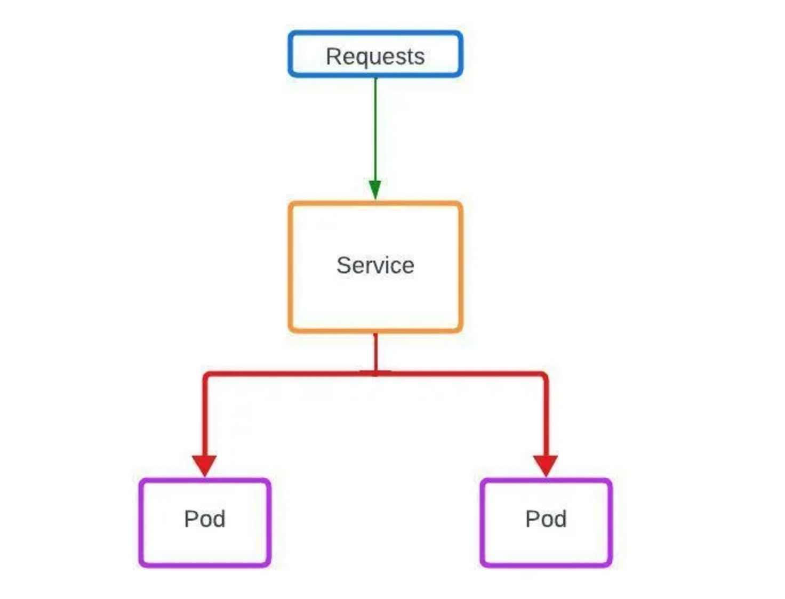
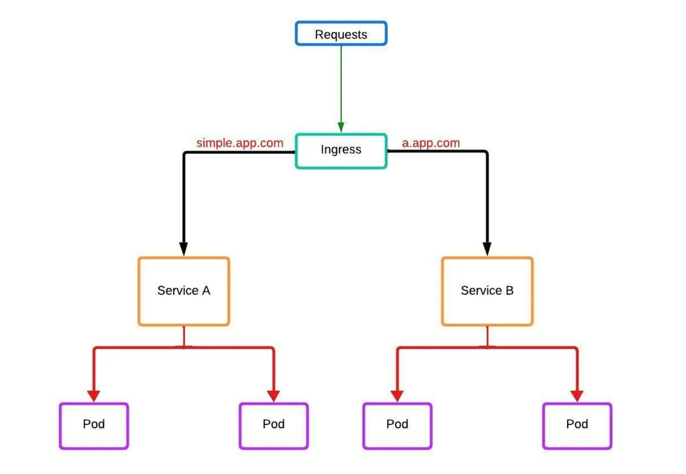
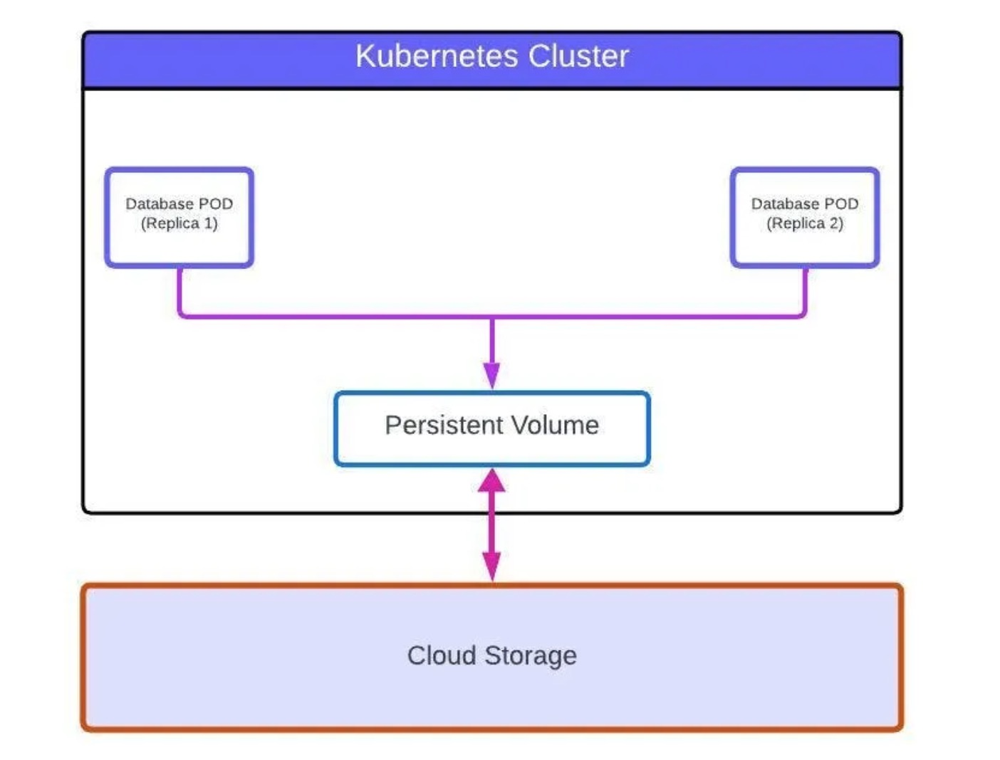
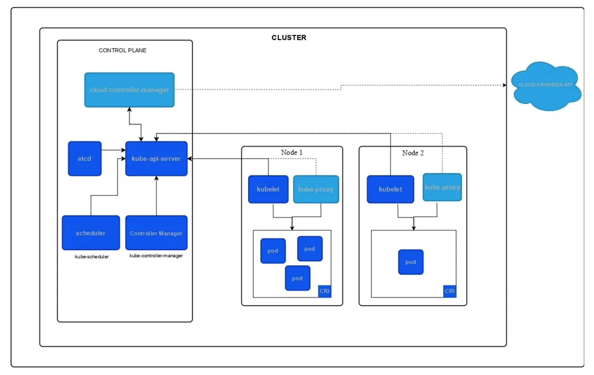
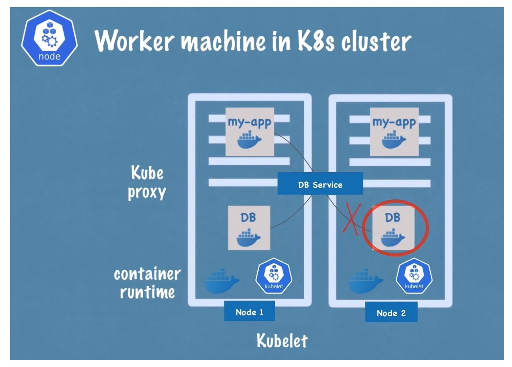
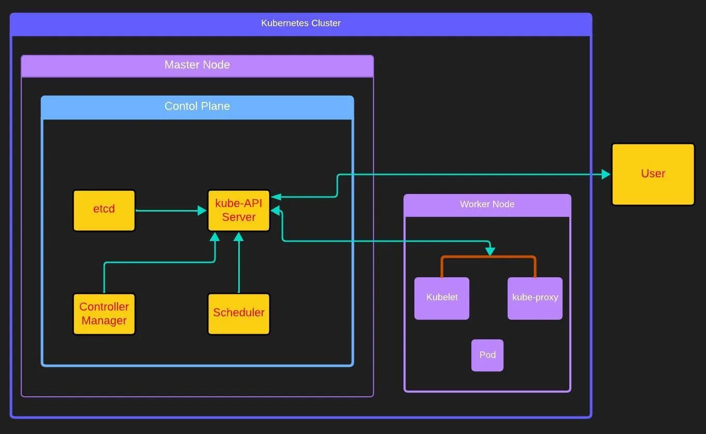
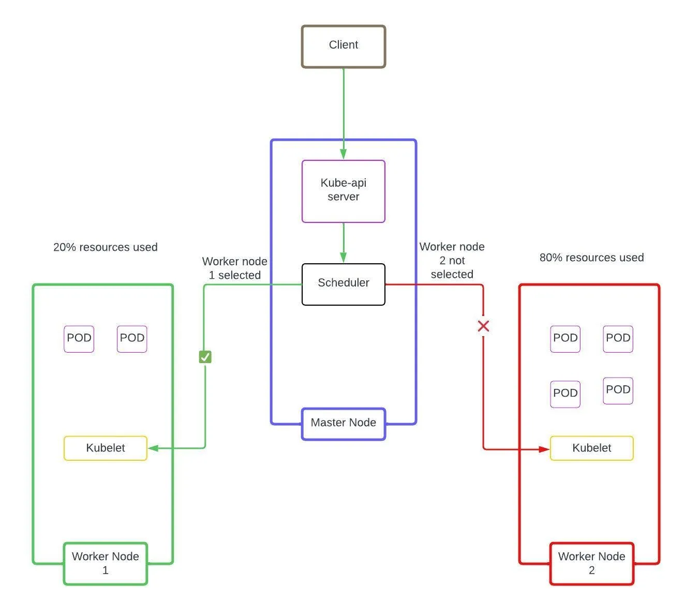

# All the fundamentals that you need to get started with Kubernetes


### [View all Roadmaps](https://github.com/nholuongut/all-roadmaps) &nbsp;&middot;&nbsp; [Best Practices](https://github.com/nholuongut/all-roadmaps/blob/main/public/best-practices/) &nbsp;&middot;&nbsp; [Questions](https://www.linkedin.com/in/nholuong/)
<br/>

## In this article, we will understand what is Kubernetes, why we need it, what are the components of Kubernetes, and all other stuff in between. I am confident that after reading and understanding this article you will have a solid understanding of Kubernetes fundamentals.

# What is Kubernetes?
Let me start by throwing some official stuff at you

Kubernetes is an open-source container orchestration framework that is developed by Google.

Kubernetes can also be written as K8s because in the name ‘Kubernetes’ there are 8 letters between k and s hence the shorthand K8s

If I have to tell you what Kubernetes is in a single line, I would say Kubernetes helps you run and manage containers, but then you will have many questions that will arise due to this answer so let’s dive deeper.

A question that may come to your mind from the above statement is that if we can run and manage a container on our own and it’s not even that difficult to do that then why add the complexity of Kubernetes?

Well to answer the above question: Yes, we do not need Kubernetes to run one or two containers but the whole equation changes when we have 100s or maybe 1000s of containers to run and manage in production. It would be very complex to manage and run 100s of containers using scripts and self-made tools. With the rise of microservices architecture applications, the usage of containers has increased.

In a monolithic architecture where you have to containerize a single app, it is simple but now with microservices architecture apps you have a container for each service of your app and each of the microservices is supposed to be scaled horizontally when there is a lot of load on any of the microservice, which would increase the number of the container of that microservice. Now you can see how fast the number of containers increases. First, our application comprises a lot of containers, and all those containers multiply, now as you can see how difficult it would be to manage all those containers. Hence K8s does all the managing for us.

# What are the managing stuff that Kubernetes does?
**High Availability and Self-healing:** K8s ensure high availability of application meaning there is no downtime because of its self-healing feature. whenever a container fails or the application inside that container crashes K8s replaces that container with a new one.
**Scalability:** K8s scales out the containers automatically based on the CPU and memory usage.
Load Balancing: If the traffic to a container is high K8s can load balance and distribute the traffic between containers.
**Service Discovery:** Kubernetes can expose a container using the DNS name or using their own IP address.
Secret and configuration management: K8s lets you store and change the configurations and sensitive information such as passwords, keys and authentication tokens in your application without the need to rebuild the container images.

# Let’s Talk About Some K8s Concepts
## Pod
Pod is the smallest unit of K8s. Pod is the component inside which a container runs, so it can be said that the pod is the abstraction over the container. Pods are the layer of abstraction on top of containers and it is so that containers are replaceable and we don’t have to directly work with container technology like Docker, so we only interact with the Kubernetes layer and that layer manages the container for us with the help of pod.

Pod generally runs only a container within itself but we can also make it run more than one container. Each pod has its own private IP address (not the container) and it is this IP address with which pods communicate with each other internally.

## Node
In K8s Machine is referred to as Node. Machine can be physical or virtual hence Node can be physical or virtual. Pods run inside Node.

## Service
In K8s pods are ephemeral which means pods can die very easily if the container application crashes inside a pod and when that happens a new pod will get created in its place with a new IP address. This is inconvenient because every time a new pod gets created in place of an old one, you will have to readjust endpoint configurations with the new pod’s IP address to sustain communication between newly created pod and other components. This is where service comes into the picture.

Service is a component in K8s which has its own IP address and network configurations like ports, protocols, etc. You can associate a pod with a service and a service’s lifecycle is independent of that of a pod which means when a pod dies and gets replaced with a new one, the service associated with that pod remains the same. So because of the service, the new pods can communicate with other components because the pods are associated with a consistent service that has an IP address and you don’t have to change the endpoint configurations.

Service also acts as a load balancer for pods, so if we have multiple pods associated with the same service, they are going to be load-balanced by the service.



## Ingress
An ingress can route traffic coming to it from the internet to multiple services based on the user-defined rules. So it can also be put the way that ingress does the forwarding of traffic from the internet to different services based on the user-defined rules. Ingress is also capable of doing SSL termination and name-based virtual hosting.

****Example:**

``` I have two services in K8s, Service A and Service B, I can define in my ingress that if traffic comes with route a.app.com, forward the request to service B else forward the traffic to Service A.
```



## ConfigMaps
In containers, the app configurations are stored within the container in environment files which the app uses inside the container. These configurations can have endpoints and other configs. Let’s say if we changed some configurations we would have to rebuild the container image again with the new configs so that the container has that updated configs and this can be a tedious task for a small change. This is where ConfigMaps comes into the picture.

ConfigMaps is a component in K8s that stores non-confidential configs and you can store the app configs here and pass it to the pod in environment variables. The container then uses the configs from ConfigMap and you will not have to rebuild the entire image when you have to change a configuration, so instead of rebuilding the entire image for config changes you can just use ConfigMap.

## Secrets
Storing confidential configurations like passwords, keys, tokens, etc in plain text in ConfigMaps is insecure and for this purpose, K8s has Secrets which is like ConfigMaps but stores sensitive and confidential configs. All configs are stored in base 64 encoded format. It is used just like ConfigMaps hence it can be passed as environment variables to pods.

## Volumes
In K8s the default volume that a pod uses is ephemeral means the volume and the data in it will get deleted when the pod crashes and gets replaced with a new one or when the pods get deleted. Some applications let’s say a database for example need the volume to not be ephemeral and be persistent instead, meaning the data should persist even after the pod gets replaced or gets deleted. Here volume comes into the picture.

A volume is a storage either on the local machine, meaning in the node in which the pod is running or it can be a remote storage outside of the Kubernetes system like a cloud storage or a premise storage. You can mount this storage using volumes to the pod so that the pod uses this storage to store data, therefore when the pod gets replaced or deleted the data will persist because the data is stored outside of the pod.



## Deployment
Deployment is a component that stores the configurations for the pod. You can define configurations like-

How many replicas or copies of a pod you want to run at a time. Replicas are used so that whenever a pod gets down, the service forwards the traffic to the other replica or replicas (As said in the services section, the service acts as a load balancer between pods) and the client does not have to face downtime.
Which nodes you want the pod to run on.
How many containers you want the pod to be running (In most cases you only run one container inside a pod).
Which port you want the pod to listen to and other networking configs.
Which image to use for the container and the URI of the image’s repository.
Limits of hardware resources like CPU and Memory that the pod is allowed to utilize.
Association of pods and nodes with labels.
Apart from the basic configurations above there are a whole lot of other configurations which the deployment can have. Remember I said in the pod’s explanation section that a pod is a layer of abstraction on top of the container? The deployment is a layer of abstraction on top of the pod, therefore we work with deployments and not with pods, so pod is the abstraction over the container and deployments is an abstraction over the pod. Pods follow the deployment configs.

## Statefulset
Stateful applications like a database needs to be run with a statefulset because their replicas need to access the same shared data storage and because of this we need some kind of mechanism that manages the synchronization between pods and deals with which pods are currently writing to that storage and which pods are reading from it to avoid data inconsistencies. This mechanism is offered by statefulset.

However, it needs to be said that in K8s deployment of stateful applications especially databases is not a straightforward process even with the help of statefulset hence running databases outside of K8s is the most implemented practice that uses a cloud provider’s managed database service like AWS’s RDS or any other cloud provided database service.

## Manifest
A manifest is a declarative configuration file that defines the desired state of Kubernetes resources. It provides a way to describe and manage workloads in a Kubernetes cluster. Manifests are typically written in YAML format and include specifications for the various resources you want to deploy. All of the above-defined components except Node are defined using manifests.

## K8s Architecture



There are two types of K8s components in K8s architecture, Control Plane Components and Node Components. Follow the points below and after the last point, you will have an understanding of these two types of components.

In K8s there are components that gets controlled and there are components that controls other components.
The components that controls are called Control Plane Components and the components that gets controlled are called Node Components.
All the components that controls (Control Plane Components) are run in a separate machine or node than the components that gets controlled (Node Components).
The node or machine which runs Control Plane Components (the components controlling other components) is referred to as Master Node.
The machine or node that runs Node Components (components that are getting controlled) is referred to as Worker Node.
Worker Nodes are the nodes that runs workloads (containers)
Worker Node Components
Usually, there are multiple worker nodes in a K8s cluster and there are 3 processes or worker node components that must run in each worker node that is used to manage pods. These 3 components are discussed below.

## CRI (Container Runtime Interface)
Because we are essentially running containers we need some kind of container technology that needs to be installed on every worker node, it can be Docker, Containerd, CRI-O or some other container technology.

## Kubelet
Kubelet is the process that takes pod specification from deployment or a statefulset and makes sure that the pod is running with the same specifications as described in the manifest and is healthy. Kubelets also interact with the node and assign node’s resources such as CPU and RAM to the pod.

## Kube-proxy
Kube-proxy implements a part of K8s Service concept which simply means that the Service component works with Kube-proxy for the networking and communication aspect in worker nodes. Kube-proxy maintains network rules on the node for efficient communication with low overhead. 
**For example-**



```
An application that is running on a node wants to send a request to a database application that has two replicas running, one in the same node as the application itself and the other replica pod in a different node.

When the application makes the request to the service of the database application, the database service instead of forwarding that request randomly to any of the database pod replicas, will actually forward that request to the replica which is running on the same node as the application that made that request. Hence making the communication efficient and performant.

(Example and above picture Taken from TechWorld with Nana Kubernetes Tutorial, here is the link to tutorial)
```
## Control Plane Components
The master node contains control plane components and it manages worker nodes. We refer to the package which has all the Control Plane Components as Control Plane and we as a user only interact with it and not with other Components. So it is safe to say that Control Plane is the single point of contact between the user and K8s. Let’s discuss the Control Plane components.

## kube-api server
When a user interacts with the K8s cluster they are interacting with the control plane and to be precise, they are actually interacting with the Kube-API server in the control plane. Users interact with it using the Kubernetes command line tool ‘kubectl’ and the kube-API server also authenticates the user request to make sure that the user is authorized to make their respective requests. It also receives requests from worker node components (Kubelet and Kube-proxy) and communicates with them. You can think kube-API server as the frontend of the K8s cluster.

When I say that the kube-api server receives user requests, the request can be to create a deployment or it can be a query request to get the status of workloads or any other kind of request. So the api-server receives the user request, validates it and forwards it to other components or processes and then gives the response back to the user.



## Scheduler
Scheduler decides on which node a pod should be scheduled, so when a user makes a request to schedule a pod, it first goes to the kube-api server and after the kube-api server validates the request, the pod gets created. Scheduler watches for pods with no assigned node and then selects a node for it.

Scheduler has smart logic inside it so when it receives a pod scheduling request, it looks at how much resources (CPU and RAM) the pod needs and then looks for the nodes that have the resources to provide to the pod. If there are multiple nodes that can provide resources to the pod, it schedules the pod to the node that has the least load on it as compared to other nodes. Apart from this, there are many other factors that are taken into account to select a node.



It should be noted here that the scheduler just decides on which node the scheduling has to be done, the component that actually schedules the pod is kubelet which is a worker node component in the selected node.

## Controller Manager
Controller manager essentially compares the desired state of the K8s cluster with the current state of the cluster at a certain rate. So when it does that and the current state is found to be different from that of the desired state it initiates action to fix that and make the current and desired state the same by matching the current state with the desired state.

So let’s say for example if you have specified that there should be two pods of nginx running and one of the pods crashes. The controller manager is comparing the desired state with the current constantly and when it detects that the desired state is with the 2 nginx pod but the current state is with 1 nginx pod, it will initiate the creation and scheduling of a new pod. Hence the current state will match the desired state.

## etcd
The etcd is a key-value database store of the K8s cluster, every information of the cluster is stored here. I mentioned in the controller manager section that the desired state and current state gets compared by the controller manager, the data of these states is stored in etcd and the controller manager retrieves the data from here. Every state change whether it’s a new pod being created or crashed or a new volume, service, statefulset, ingress, etc is getting created and deleted, every change is stored here.

Whenever a user queries how many pods, deployments, services, statefulsets, etc. are running to the kube-API server, the kube-API server retrieves that information from etcd and gives it to the user.

## Kubectl
We interact with the K8s cluster with the kubectl command line tool. Below are some widely used kubectl commands.

**kubectl get pods** (get how many pods are running in K8s cluster and info related to them)
**kubectl get deployment** (get how many deployments are running in K8s cluster and info related to them)
**kubectl get service** (get how many services are running in K8s cluster and info related to them)
**kubectl apply -f "filename"** (Use the name of the k8s manifest in place of filename that you want to apply)
**The Kubectl describe commands** are used to get all the information of a manifest implementation. They are widely used for diagnostic purposes when pods are getting crashed or some error is constantly appearing in K8s cluster.

**```kubectl describe <what you want to describe> <the name of what you want to describe>```**

You can use **pod, deployment, statefulset, service, volume, etc** in place of <what you want to describe> to know about that component and then put the name of that component in place of <the name of what you want to describe> to get the info about that specific component.

**example-**
**kubectl describe statefulset my-statefulset**

**Conclusion**
This is enough and more to get started with Kubernetes. I just want to let you know here that I have covered basic aspects of the components and architecture and there is a lot more to them than what I have explained to keep the blog beginner friendly. The Kubernetes documentation is irreplaceable and when you have made some beginner projects in K8s you must take a look into the official K8s documentation. Kubernetes with all its complexities is best described in their documentation.


# 🚀 I'm are always open to your feedback.  Please contact as bellow information:
### [Contact ]
* [Name: nho Luong]
* [Skype](luongutnho_skype)
* [Github](https://github.com/nholuongut/)
* [Linkedin](https://www.linkedin.com/in/nholuong/)
* [Email Address](luongutnho@hotmail.com)
* [PayPal.me](https://www.paypal.com/paypalme/nholuongut)


[](https://ko-fi.com/nholuong)

# License
* Nho Luong (c). All Rights Reserved.🌟